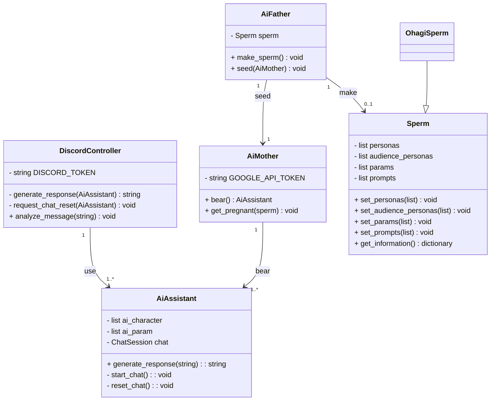

# discord_bot
## BluerPrint

```mermaid
classDiagram
    class DiscordController {
        - string DISCORD_TOKEN
        - generate_response(AiAssistant) string
        - request_chat_reset(AiAssistant) void
        + analyze_message(string) void
    }

    class AiAssistant {
        - list ai_character
        - list ai_param
        - ChatSession chat
        + generate_response(string): string
        - start_chat(): void
        - reset_chat(): void
    }

    class AiMother {
        - string GOOGLE_API_TOKEN
        + bear() AiAssistant
        + get_pregnant(sperm) void
    }

    class AiFather {
        - Sperm sperm
       + make_sperm() void
       + seed(AiMother) void
    }

    class Sperm {
        - list personas
        - list audience_personas
        - list params
        - list prompts
        + set_personas(list) void
        + set_audience_personas(list<string>) void
        + set_params(list) void
        + set_prompts(list) void
        + get_information() dictionary
    }

DiscordController "1"-->"1..*" AiAssistant: use
AiMother "1"-->"1..*"AiAssistant : bear
AiFather "1"-->"1"AiMother : seed
AiFather "1"-->"0..1"Sperm : make
OhagiSperm --|> Sperm
```

## 開発環境構築
```bash
python3 -m venv discord_bot
source discord_bot/bin/activate
pip install -r requirements.txt
```